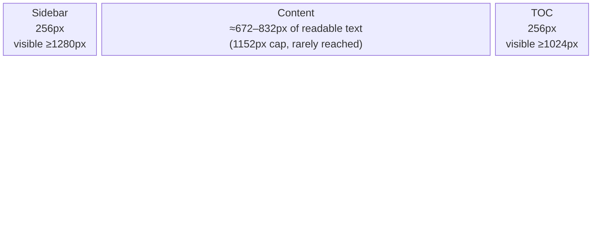

The docs page is a horizontal row of up to three panes — left sidebar,
center content, right table of contents (TOC) — inside a wrapper capped by
`page.width`. The navbar above it is capped separately by `navbar.width`,
which should normally match `page.width`; see the note at the end.

## The panes, at a glance

This is drawn to the proportions of a 1440px (`page.width: wide`) viewport with
both rails visible. It is not to scale below `xl` (1280px), where the sidebar
stops being persistent — see [Breakpoints](#breakpoints).

## Where each width comes from

| Pane | Width | Configurable? | Source |
|---|---|---|---|
| Wrapper (sidebar + content + TOC) | `page.width`: `normal` = 80rem (1280px), `wide` = 90rem (1440px), `full` = 100% | Yes, `params.page.width` | [`docs/width-class.html`](https://github.com/solo-io/docs-theme-extras/blob/main/layouts/partials/docs/width-class.html), [`utils/page-width.html`](https://github.com/solo-io/docs-theme-extras/blob/main/layouts/partials/utils/page-width.html) |
| Navbar | Same three options as `page.width` | Yes, `params.navbar.width` (keep it matching `page.width`) | [`layouts/_partials/navbar.html`](https://github.com/solo-io/docs-theme-extras/blob/main/layouts/_partials/navbar.html) |
| Sidebar | 256px (`w-64`) | No — fixed | [`partials/sidebar.html`](https://github.com/solo-io/docs-theme-extras/blob/main/layouts/partials/sidebar.html) |
| TOC | 256px (`w-64`) | No — fixed | [`_partials/toc.html`](https://github.com/solo-io/docs-theme-extras/blob/main/layouts/_partials/toc.html) |
| Content (`<main id="content">`) | 1152px (72rem) max-width cap | Indirectly — a consumer can override the [`docs/content-class.html`](https://github.com/solo-io/docs-theme-extras/blob/main/layouts/partials/docs/content-class.html) extension slot; agentgateway-oss-website does, to the same 1152px | Vendored Hextra, hardcoded — there is no `content.width` param |

The content cap rarely binds in practice: at any `page.width` up to `wide`
(1440px), subtracting the sidebar and TOC leaves less room than the 1152px
cap, so the real constraint on content width is the wrapper width minus the
rails, not the cap itself (see the worked numbers below). The cap only takes
over on very wide viewports with `page.width: full`.

## Worked numbers by `page.width`

Assuming both the sidebar and TOC are visible (viewport ≥1280px) and content
carries its own `hx:md:px-12` (48px each side) padding:

| `page.width` | Wrapper | Sidebar | TOC | Remaining for content | Content padding | Net readable text |
|---|---|---|---|---|---|---|
| `normal` (80rem) | 1280px | 256px | 256px | 768px | 96px | ≈672px |
| `wide` (90rem) | 1440px | 256px | 256px | 928px | 96px | ≈832px |
| `full` | = viewport | 256px | 256px | viewport − 512px | 96px | viewport − 608px (until the 1152px cap binds, around viewport ≈1760px+) |

So a hoped-for "content pane ≤800px" holds at `page.width: normal` (≈672px)
but not quite at `wide` (≈832px) — `wide` is what agentgateway-oss-website and
the `docs` hub's agentgateway product both use.

## Breakpoints

| Pane | Persistent at | Below that | Source |
|---|---|---|---|
| Sidebar | `xl`, 1280px | Slide-in drawer (280px, fixed), toggled by hamburger | [`partials/sidebar.html`](https://github.com/solo-io/docs-theme-extras/blob/main/layouts/partials/sidebar.html), `docs-theme-extras.css` (mobile drawer rules) |
| TOC | 1024px | Hidden entirely (no drawer equivalent) | `docs-theme-extras.css` — this module lowers Hextra's own `xl` (1280px) TOC breakpoint to `min-width: 1024px` |
| Hamburger trigger | — | Wired below 768px; the tablet-only trigger (768–1279px) opens the same sidebar drawer | [`layouts/_partials/navbar.html`](https://github.com/solo-io/docs-theme-extras/blob/main/layouts/_partials/navbar.html) |

Note the TOC and sidebar do **not** share a breakpoint in this module: between
1024px and 1279px the TOC is visible but the sidebar is drawer-only, which is
a deliberate divergence from vendored Hextra (where both use `xl`).

## Keep `navbar.width` matching `page.width`

The navbar and the content wrapper are two independent settings —
`params.navbar.width` and `params.page.width` — and nothing enforces that
they agree. If they diverge, the navbar's logo drifts out of alignment with
the sidebar below it as the window resizes. Until this module's `[Unreleased]`
fix (see `CHANGELOG.md`), `navbar.width` was silently discarded and the
navbar always rendered at the `wide` default regardless of what a consumer
set — worth knowing if you're diagnosing an older pinned version.
