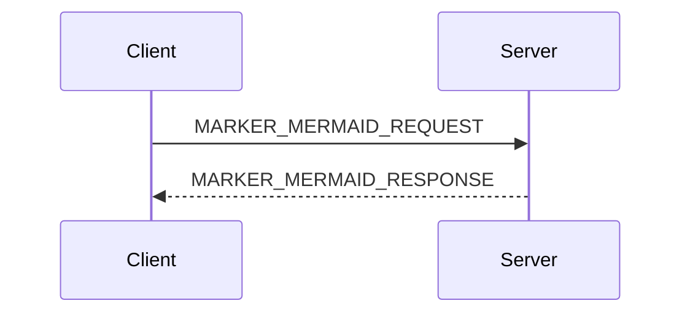

## Alerts

### Info

MARKER_ALERT_INFO. Informational alerts use the info context.

### Warning

MARKER_ALERT_WARNING. Warning alerts use the warning context.

### Danger (with nested reuse)

MARKER_ALERT_DANGER. Danger alerts can wrap a reuse: MARKER_ALERT_WITH_REUSE → 

### Success

MARKER_ALERT_SUCCESS. Success alerts use the success context.

## Callout

In the local override at `layouts/shortcodes/callout.html`, the `callout` shortcode is implemented identically to `alert` — same context-to-class map, same icon set, same DOM. The two are aliases. The fixture exercises all four canonical types so a regression that drifts one shortcode away from the other surfaces immediately.

### Info

{}MARKER_CALLOUT_INFO. Callouts use the same context-to-class map as alerts; this one is the info variant.{}

### Warning

{}MARKER_CALLOUT_WARNING. Warning callout.{}

### Danger

{}MARKER_CALLOUT_DANGER. Danger callout.{}

### Success

{}MARKER_CALLOUT_SUCCESS. Success callout.{}

## Cards


{}{}




## Checklist


- [ ] MARKER_CHECKLIST_1. First checklist item.
- [ ] MARKER_CHECKLIST_2. Second checklist item, persisted in localStorage.
- [ ] MARKER_CHECKLIST_3. Third item to confirm three render side-by-side.


## Code blocks (highlighting and language tags)

Code-block coloring, line numbers, and language detection rely on Chroma. The fixture includes one block per common language so tests can assert the `language-*` class is emitted.

### Per-language fences (yaml, sh, go)

```yaml
# MARKER_CODE_YAML
servers:
  - name: registry
    port: 8080
```

```sh
# MARKER_CODE_SH
kubectl get pods -n marker-test
```

```go
// MARKER_CODE_GO
package main

func main() {
    println("hello, fixture")
}
```

### Line numbering

A code block with line numbering — Chroma renders `linenos=true` as a sibling `<table>` of line-number cells. The fixture asserts the `lntable` / `lnt` class shows up on this block:

```yaml {linenos=true}
# MARKER_LINENOS
apiVersion: gateway.networking.k8s.io/v1
kind: Gateway
metadata:
  name: line-number-fixture
spec:
  gatewayClassName: kgateway
```

### Line highlighting

A code block with line highlighting — Chroma wraps the highlighted lines in `<span class="line hl">`. The fixture highlights lines 2 and 4:

```yaml {hl_lines=[2,4]}
# MARKER_HIGHLIGHTED
apiVersion: gateway.networking.k8s.io/v1
kind: Gateway
metadata:
  name: highlight-fixture
```

### Line numbering and highlighting combined

```yaml {linenos=true,hl_lines=[2,4]}
# MARKER_HIGHLIGHT_NUMBERED
apiVersion: gateway.networking.k8s.io/v1
kind: Gateway
metadata:
  name: numbered-and-highlighted-fixture
spec:
  gatewayClassName: kgateway
```

### Tilde fence

A tilde fence is the alternate fence syntax — useful when the code itself contains a backtick-delimited block:

~~~yaml
# MARKER_FENCE_TILDE
example: |
  ```nested
  This nested block uses backticks; the outer fence is tildes.
  ```
~~~

### Indented code (no fence)

An indented code block (4-space indentation, no fence). Goldmark's CommonMark default treats four leading spaces as a code block:

    # MARKER_FENCE_INDENTED
    indented_code: true

### Long line (horizontal scroll)

A code block with a single line wider than any reasonable viewport. The Hextra theme should render the surrounding `<pre>` with `overflow-x: auto` so readers can scroll horizontally instead of having the content wrap or get clipped. The browser-project test confirms `scrollWidth > clientWidth` on this block (i.e., it's actually overflowing) and that programmatically setting `scrollLeft` moves the viewport.

```json
{"marker":"MARKER_CODE_LONG_LINE","purpose":"deliberately long single-line JSON to verify horizontal scroll on overflowing code blocks","filler":"AAAAAAAAAAAAAAAAAAAAAAAAAAAAAAAAAAAAAAAAAAAAAAAAAAAAAAAAAAAAAAAAAAAAAAAAAAAAAAAAAAAAAAAAAAAAAAAAAAAAAAAAAAAAAAAAAAAAAAAAAAAAAAAAAAAAAAAAAAAAAAAAAAAAAAAAAAAAAAAAAAAAAAAAAAAAAAAAAAAAAAAAA"}
```

## Conditional text by build condition

The site's `buildCondition` is `test`. The blocks below test that the conditional-text shortcode includes and excludes correctly.

### Include when matching

{}COND_TEST_ONLY. This sentence is visible only when buildCondition equals test.{}

### Exclude when matching

{}COND_NOT_TEST. This sentence should never appear in the rendered fixture.{}

## Curl URL quoting

URLs inside curl commands must be wrapped in quotes. Without quotes, shell metacharacters in the URL — `&` (background), `?` (glob), `#` (comment), `*` (glob), spaces — break the command when a reader hits the code-block copy button and pastes into a terminal. Tests assert that every `curl` command in the docs source quotes its URL.

### Double-quoted URL

Double-quoted (the common case — allows shell variable expansion inside the URL):

```sh
# MARKER_CURL_DOUBLE_QUOTED
curl -X POST "https://api.example.com/v1/things?id=42&format=json" \
  -H "Content-Type: application/json" \
  -d '{"name":"fixture"}'
```

### Single-quoted URL

Single-quoted (use when the URL must be treated as fully literal — no `$VAR` expansion):

```sh
# MARKER_CURL_SINGLE_QUOTED
curl 'https://api.example.com/v1/things?id=42&format=json'
```

### Multi-line continuation

Multi-line continuation with the URL on its own line is fine, as long as the URL itself is quoted:

```sh
# MARKER_CURL_MULTILINE
curl -sSL \
  "https://example.com/install.sh" \
  | bash
```

## Details


MARKER_DETAILS. Details bodies hide until clicked. Bodies render markdown, including **bold**, *italic*, and inline `code`.


## GitHub embed

The `github` shortcode fetches a remote file at build time via `resources.GetRemote` and inlines it. This brings a network dependency into every CI build — kept here because production docs use it.

The shortcode behaves differently per file extension. Markdown URLs run through the page's markdown renderer; everything else is passed through as raw text and is typically wrapped in a code fence by the caller. The three subsections below exercise each branch.

### Markdown rendering

Fetching a markdown file (no fence around the call). The fetched table and links should render as proper HTML. The fixture URL points to a heading-free file so this section doesn't pollute the page TOC.

MARKER_GITHUB. The fetched content from the URL below appears inline:



### YAML in a code fence

Fetching a YAML file inside a code fence. The fetched YAML should appear as the body of a fenced code block, not as rendered markdown:

MARKER_GITHUB_YAML. The fetched YAML appears below:

```yaml

```

### Plain text in a code fence

Fetching a text file (no extension match) inside a code fence. Same passthrough behavior as YAML — the file content should appear in a code block as plain text:

MARKER_GITHUB_TEXT. The fetched text appears below:

```

```

## GitHub table

The `github-table` shortcode is a section-extracting variant of `github` — fetches a remote markdown file and inlines only the content under a named section heading.

MARKER_GITHUB_TABLE. The extracted "Functions" section appears below:

{}

## Images

### Icon

The icon shortcode emits inline SVG: 

### Mermaid diagram

The fixture renders mermaid both fenced and as a shortcode equivalent. Hextra renders fenced ` ```mermaid ` blocks via JavaScript at load time.



### SVG diagram with link

An inline SVG with `role="img"` and `aria-label` (so screen readers announce the diagram), wrapped in an `<a>` so clicking the diagram navigates. The `link` shortcode resolves the destination URL inside the `href` attribute before markdown rendering.

<a href="" aria-label="Open the companion page">
<svg xmlns="http://www.w3.org/2000/svg" width="240" height="80" viewBox="0 0 240 80" role="img" aria-label="MARKER_SVG_ALT. A diagram showing a Client box connected to a Server box by an arrow.">
  <title>MARKER_SVG_ALT. A diagram showing a Client box connected to a Server box by an arrow.</title>
  <defs>
    <!-- currentColor here resolves to the stroke color of the <line>
         that references this marker. The line itself uses currentColor,
         which inherits from the surrounding text color — so the arrow
         tip stays visible in both light and dark mode. -->
    <marker id="test-arrow" markerWidth="10" markerHeight="10" refX="9" refY="3" orient="auto">
      <polygon points="0,0 10,3 0,6" fill="currentColor"/>
    </marker>
  </defs>
  <!-- Box stroke + connector line + arrow all use currentColor so they
       adapt to the page theme. Box fill stays white and the text inside
       stays dark — that contrast is intentional and works against both
       light and dark page backgrounds. -->
  <rect x="5" y="20" width="80" height="40" fill="#fff" stroke="currentColor" stroke-width="2"/>
  <text x="45" y="44" text-anchor="middle" font-family="-apple-system, system-ui, sans-serif" font-size="14" fill="#1a1a1a">Client</text>
  <!-- x2 stops at 152 (not 155) so the marker's arrow tip lands on the
       page background just before the right box. If the tip overlaps the
       white box, `currentColor` makes it invisible in dark mode (light
       arrow on white box). With the line geometry:
         line ends at world x=152
         marker refX=9, markerWidth=10 → tip is at world x=153
         box starts at x=155
       → 2-unit gap; tip is always on page bg, always visible. -->
  <line x1="85" y1="40" x2="152" y2="40" stroke="currentColor" stroke-width="2" marker-end="url(#test-arrow)"/>
  <rect x="155" y="20" width="80" height="40" fill="#fff" stroke="currentColor" stroke-width="2"/>
  <text x="195" y="44" text-anchor="middle" font-family="-apple-system, system-ui, sans-serif" font-size="14" fill="#1a1a1a">Server</text>
</svg>
</a>

## Internal links via the link shortcode

### link shortcode (in-product)

Use the [companion page]({}) to compare. The `link` shortcode resolves the path against the current section so it stays version-correct.

The link shortcode also has a value form for inline use — the rendered URL becomes the sentinel-bearing text:

The link shortcode resolves to MARKER_LINK=.

### link-hextra shortcode (cross-product)

The `link-hextra` shortcode is the cross-product variant; it expects a product/version-prefixed URL. The fixture's URL pattern (`/test/v?/`) is not in link-hextra's auto-detect list, so the version must be passed explicitly:

The link-hextra shortcode resolves to a clickable [MARKER_LINK_HEXTRA]() link.

## Lists (3-level ordered and unordered)

### Ordered (3 levels)

A 3-level ordered list — the deepest level carries `MARKER_OL_L3` so tests can assert nesting depth round-trips through goldmark:

1. Ordered level 1 (MARKER_OL_L1).
   1. Ordered level 2 (MARKER_OL_L2).
      1. Ordered level 3 (MARKER_OL_L3).
      2. Ordered level 3, second item.
   2. Ordered level 2, second item.
2. Ordered level 1, second item.

### Unordered (3 levels)

A 3-level unordered list:

- Unordered level 1 (MARKER_UL_L1).
  - Unordered level 2 (MARKER_UL_L2).
    - Unordered level 3 (MARKER_UL_L3).
    - Unordered level 3, second item.
  - Unordered level 2, second item.
- Unordered level 1, second item.

## Multi-block conditional with bullets and code (debug-gateway pattern)

This block exercises the Hugo edge case where blank lines inside a percent-form shortcode can inject extra paragraph wrappers around bullets and code blocks. Tests should confirm the bullets and the code block render as a list and a `<pre>`, not as plain `<p>` paragraphs.

{}
- COND_BULLET_1. First bullet inside a conditional block.
- COND_BULLET_2. Second bullet inside a conditional block.
- COND_BULLET_3. Third bullet inside a conditional block.

```sh
# COND_CODE_INSIDE_CONDITIONAL
kubectl logs -n marker-test deploy/test-fixture
```
{}

## Nested conditionals (conditional-text wrapping version wrapping link)

Real product docs nest a buildCondition gate around a per-version gate around a link, so the link target differs per product *and* per version. The sentence below — sentinel, prose, and link URL — only renders on v2 with buildCondition `test`.

{}{}MARKER_NESTED_LINK. See the [companion page]({}) for the same content rendered through the alternate render path.{}{}

## OpenAPI rendering

The `openapi` shortcode renders a Swagger UI viewer for a local spec. The sample lives at `assets/test/openapi/sample.yaml` and contains `MARKER_OPENAPI` in the path summary so tests can assert the spec was loaded.



## Prism syntax highlighting

The `prism` shortcode is the older highlight-with-line-targeting wrapper. It maps to Hugo Chroma the same way fenced blocks do, but uses positional/named args instead of fence attributes.


{
  "marker": "MARKER_PRISM",
  "highlighted": true,
  "explanation": "lines 2 and 3 should be highlighted"
}


## Read file

The `readfile` shortcode pulls an arbitrary file from the project tree. Useful when you need to surface a license, sample config, or generated artifact without copying it into Markdown.



## Reuse and snippets

### Inline reuse

Inline reuse: 

### Two-level reuse depth

Two-level reuse depth — `nested-snippet.md` itself reuses `snippet.md`:



## Reuse images (light and dark variants)

### Light and dark variants in one call

The `reuse-image` shortcode emits both the light and dark variants in one call. The companion `reuse-image-dark` shortcode emits only the dark variant — useful when the light and dark images need to be wrapped in different containers (e.g., side-by-side comparisons).



### Dark variant only

The `reuse-image-dark` variant by itself (renders only when dark mode is active):



### Light variant only

The `reuse-image-light` variant by itself (renders only when light mode is active):



### Version-gated image

A version-gated image variant (only renders on v2 after remap) — uses `reuse-image` inside a `version` block:



### Figure inside a conditional-text block (mixed block content)

A build-gated section that mixes a code fence, a bullet, and a `reuse-image` figure inside one `conditional-text` block — the kgateway operations/debug "Debug your gateway setup" shape. `reuse-image` emits raw block HTML (a `div` wrapping a `figure` and `img`); this case pins that it renders as a real `figure` element on the matching build rather than leaking as escaped `&lt;div&gt;` text. The markdown-leaks scan's `escaped-html` rule fails the build if a figure here ever regresses to escaped tags.

{}
Port-forward the proxy admin interface:

```sh
kubectl port-forward deploy/test -n marker-test 19000
```

* [http://localhost:19000/](http://localhost:19000/)


{}

## Steps

The Hextra `steps` shortcode wraps an H3-headed sequence in a styled left-border container with CSS-counter step numbers. Tests can assert the `.hextra-steps` wrapper and that each step's heading and body are present.

{}

### MARKER_STEP_1. Install the prerequisites

Pull the latest version pin via reuse: `tag=`. The reuse resolves before Chroma runs.

### MARKER_STEP_2. Apply the configuration

Apply a small manifest:

```sh
kubectl apply -f - <<EOF
apiVersion: v1
kind: ConfigMap
metadata:
  name: marker-step-2
data:
  step: "2"
EOF
```

### MARKER_STEP_3. Verify

Confirm the resource exists, then move on.

{}

## Tables

| Column A | Column B | Column C |
| -------- | -------- | -------- |
| MARKER_TABLE_ROW1A | MARKER_TABLE_ROW1B | row 1 cell C |
| row 2 cell A | row 2 cell B | row 2 cell C |

### Version shortcode wrapping a table row

Reproduces the kgateway k8sgwapi-exp.md pattern: a markdown table where authors try to gate an entire row with a version shortcode. Both forms are broken — the percent form spills the row outside the table as a paragraph, and the angle-bracket form wraps the whole pipe-string in a single `<td>` cell so the cell delimiters never get parsed. Tests pin both failure shapes as fail-pending so a future fix flips them green. A third table below shows the working pattern (per-cell conditionals with pipes outside the shortcode tags).

Percent-form, inline (current behavior: gated row renders as `<p>| ... |</p>` outside the table):

| Feature | Min version |
| --- | --- |
| MARKER_TABLE_VERSION_ROW_BASELINE_FEATURE | 1.0 |
{}| MARKER_TABLE_VERSION_ROW_PERCENT_FEATURE | 2.0 |{}

Angle-bracket form, inline (current behavior: gated row renders inside the table but the whole row is a single `<td>` with literal pipes as text):

| Feature | Min version |
| --- | --- |
| MARKER_TABLE_VERSION_ROW_ANGLE_BASELINE | 1.0 |
| MARKER_TABLE_VERSION_ROW_ANGLE_FEATURE | 2.0 |

Angle-bracket form with `keepVersion="true"` — covers the case where the version arg needs to propagate into nested reuse calls within the cells. The table-row regex extends past the closing `"` of the include-if value to absorb any extra args before the closing `>}}`:

| Feature | Min version |
| --- | --- |
| MARKER_TABLE_VERSION_ROW_KEEPVERSION_BASELINE | 1.0 |
| MARKER_TABLE_VERSION_ROW_KEEPVERSION_FEATURE | 2.0 |

Per-cell conditional (works today: pipes stay outside the shortcode, version gates only the cell content; on the excluded version the row is still emitted with empty cells, so this isn't a true "conditional row" but it is the only pattern that produces two real `<td>` cells):

| Feature | Min version |
| --- | --- |
| MARKER_TABLE_VERSION_ROW_PERCELL_BASELINE | 1.0 |
| MARKER_TABLE_VERSION_ROW_PERCELL_FEATURE | 2.0 |

## Tabs in both shortcode forms

Tabs accept both forms. The outer tabs uses the angle-bracket form and the inner tab uses the percent form so its body renders as markdown.


{}
MARKER_TAB_YAML. Inside the YAML tab.

```yaml
apiVersion: v1
kind: ConfigMap
metadata:
  name: marker-tab-yaml
data:
  fixture: "MARKER_TAB_YAML"
```
{}
{}
MARKER_TAB_BASH. Inside the Bash tab.

A reuse inside a code fence resolves to its snippet content before Chroma highlights the block. Real docs use this for version pins, for example `--version=$VERSION`:

```sh
echo "MARKER_TAB_BASH"
# MARKER_REUSE_IN_CODE expanded version follows:
istioctl install --set profile=demo --set tag=
```
{}


## Tabs in ordered lists

A real-product pattern: a numbered procedure with a tabs block in the middle. Tests assert that the post-tab steps continue from the pre-tab count (3, 4) rather than restarting at 1, and that substep numbering inside a tab is independent.

1. MARKER_NUMBERED_BEFORE_TAB. First step before the tabs.
2. Second step before the tabs.

   
   {}
   1. MARKER_NUMBERED_INSIDE_TAB. Substep inside Option A. The tab body has its own ordered list scope.
   2. Second substep inside Option A.
   {}
   {}
   1. Substep inside Option B.
   2. Second substep inside Option B.
   {}
   

3. MARKER_NUMBERED_AFTER_TAB. Step after the tabs (continues from 2).
4. Final step.

## Tabs in steps

Real product docs sometimes have a tabs block inside a step (e.g., "Apply via kubectl or Helm"). The CSS counter that numbers steps must continue across the tabs block, not restart, so the procedure reads as 1, 2, 3, 4 — not 1, 2 (with embedded 1, 2), 3, 4 visually counted as 1, 2, 3, 4 etc. Tests assert that all four step markers appear in source order inside one `.hextra-steps` wrapper, and that the tab markers from step 2 are nested inside that step (not outside the steps shortcode).

{}

### MARKER_STEPS_TABS_1. First step before the tabs

A normal step with prose only.

### MARKER_STEPS_TABS_2. Step containing a tabs block

This step body has a tabs block in the middle. Both tab panels should render, and the next step should still increment the step counter to 3.


{}
MARKER_STEPS_TABS_A. Inside the Option A tab body.

```sh
echo "option-a"
```
{}
{}
MARKER_STEPS_TABS_B. Inside the Option B tab body.

```sh
echo "option-b"
```
{}


### MARKER_STEPS_TABS_3. Step after the tabs

Confirms the step after the tabs is numbered 3, not 1.

### MARKER_STEPS_TABS_4. Final step

Final step in the procedure.

{}

## Tabs with blank-line code fences

Reproduces the percent-form double-markdownify bug. A percent-form tab shortcode
pre-renders its body through Markdown before `tab.html` runs. If `tabs.html` then calls
`markdownify` on that already-rendered HTML, the CommonMark HTML-block parser (Goldmark)
terminates `<pre>` at blank lines and injects `<p>` tags — breaking code blocks and the
Hextra copy button. The fixture uses a multi-group shell session (blank lines between
command groups) inside a percent-form tab: the exact pattern that broke real product
pages in the ECS integration guide.


{}
MARKER_TAB_BLANKFENCE_PROSE. A percent-form tab body containing a code block with blank lines between command groups.

```sh
# MARKER_TAB_BLANKFENCE_BEFORE — first command group
kubectl apply -f manifest.yaml

# MARKER_TAB_BLANKFENCE_AFTER — second group after a blank line
kubectl get pods -n example
```
{}


## Hextra defaults

Several shortcodes ship with Hextra and aren't overridden by the module. The fixture exercises a representative subset so the harness catches regressions when Hextra is upgraded.

### Badge

The `badge` shortcode renders a labeled pill. Real docs use it for status indicators (deprecated, beta, enterprise-only):



### Filetree

The `filetree` shortcode is a composite of container, folder, and file. The folder `name` attribute below puts MARKER_FILETREE in the rendered tree, confirming the composite resolves end-to-end:


  
    
  


### Include

The `include` shortcode renders another content page's shortcodes inline. Distinct from the module's `reuse` shortcode, which reads from `assets/conrefs/`:

{}

## Versioned content

Each block below renders only when the page's section matches the version filter. Sentinels make per-version assertions trivial.

### Single-version include and exclude

MARKER_V1_ONLY. This sentence is visible only on v1.

MARKER_V2_ONLY. This sentence is visible only on v2.

MARKER_MAIN_ONLY. This sentence is visible only on main.

MARKER_NOT_V1. This sentence is visible on every version except v1.

### Comma-separated multi-version include

Comma-separated `include-if` lets one block match multiple versions (real docs commonly use forms like `include-if="2.11.x,2.10.x,2.9.x"`):

MARKER_V1_OR_MAIN. Renders on v1 OR main, not v2.

### keepVersion flag (rebase pipeline)

`keepVersion="true"` is consumed by the rebase pipeline — it converts the angle-bracket form to a percent form with the parent version injected, so nested reuse calls inherit the correct version context. Note that `keepVersion` is processed before the OSS-to-enterprise version remap, so the strings inside `include-if` use the enterprise form directly:

MARKER_KEEP_VERSION. Renders on v1 or main; the keepVersion flag preserves the calling version for nested reuse calls when this block is read through the alternate render path.

### Multi-block version inside a nested numbered list (ambient-ecs pattern)

Reproduces the bug from solo-io/docs#2480. A version block wraps bullets and fenced code inside a level-2 numbered step, where list-item continuation sits at 6-space source indent. Without the dedent + structural-flatten in `version.html`, the bullets render as a literal `<pre><code>` (CommonMark's "4 spaces = code block" rule biting `RenderString` on the raw indented `.Inner`), and the rendered output's embedded newlines escape the surrounding `<ol>` and break out into the parent flow.

1. Outer step.
   1. Inner step that wraps a version block.
      
      * MARKER_VERSION_NESTED_BULLET_1. First bullet inside a version block.
      * MARKER_VERSION_NESTED_BULLET_2. Second bullet.
      * MARKER_VERSION_NESTED_BULLET_3. Third bullet.
      ```sh
      # MARKER_VERSION_NESTED_CODE
      echo "fenced code inside a version block"
      ```
      

### Version shortcode INSIDE a fenced code block (yaml comment + key)

Reproduces the ambient-manual-install-multi.md pattern: a version shortcode opens at the end of one yaml line and closes at the end of another, INSIDE a code fence. Without the no-markdown heuristic, RenderString mangles the inner yaml: the leading `#` becomes h1, `"true"` becomes curly quotes, and the rendered HTML appears as literal angle-bracket text inside the highlighted code. With the heuristic, the inner content has no markdown markers and is emitted raw, landing back inside the fence as plain text.

```yaml
env:
  MARKER_VERSION_INFENCE_KEY: "marker-before"
  # MARKER_VERSION_INFENCE_COMMENT
  MARKER_VERSION_INFENCE_GATED: "true"
  trailing: after-version
```

### Version shortcode INSIDE a fence with yaml placeholders

Reproduces the ambient-multi-link.md pattern: a version shortcode inside a yaml fence wraps lines containing `<placeholder>` angle-bracket tokens. Without a precise HTML-tag regex, the placeholders look like HTML opens and the heuristic falsely routes to RenderString. With the lowercase-name-terminated-by-space/slash/`>` rule, yaml placeholders don't trip the detector.

```yaml
metadata:
  labels:
    network: cluster1
    region: "<MARKER_VERSION_INFENCE_PLACEHOLDER_UPPER>"
    zone: "<a_MARKER_VERSION_INFENCE_PLACEHOLDER_LOWER>"
  name: marker-version-infence-placeholder
```

### Version shortcode wrap-around fence (prose + fence inside version block)

Reproduces the ambient-multi-ew-gateway.md pattern: a version shortcode opens OUTSIDE a fence, wraps prose plus an entire fenced yaml block, and closes on the same line as the closing backticks. The rendered HTML contains a pre block from Chroma — the flatten step's regex would collapse the per-line span boundaries onto one line and replace every `\` line-continuation with literal closing-span text. The pre flatten-bypass keeps the highlighted output intact.


MARKER_VERSION_WRAPAROUND_BULLET: versioned Helm install — use the chart with the snippet below.

```yaml
function MARKER_VERSION_WRAPAROUND_FN() {
  context=${1:?context}
  cluster=${2:?cluster}
  helm upgrade -i fixture-chart oci://${HELM_REPO}/fixture \
    --version ${IMAGE_TAG} \
    --namespace fixture \
    --kube-context ${context} \
    -f - <<EOF
spec:
  create: true
  cluster: ${cluster}
  # MARKER_VERSION_WRAPAROUND_COMMENT yaml comment inside the fence
  network: ${cluster}
EOF
}
```

## Shortcodes in rich markdown contexts

This block matrix exercises the `version` and `conditional-text` shortcodes inside the markdown structures that real product docs nest them in. Each subsection tests a different host context. The version markers are mostly v2-gated; the conditional markers all render under buildCondition `test`. The structural-context spec asserts each marker lands inside the expected container element rather than leaking out into the surrounding flow.

### Inside callouts

A version block inside an alert and a conditional-text block inside a callout — the shortcode bodies must survive the host shortcode's inner-render pass.

Prefix text. MARKER_VERSION_IN_CALLOUT. v2-only sentence inside the alert.

{}Prefix text. {}COND_IN_CALLOUT. Build-gated sentence inside the callout.{}{}

### Inside a 3-level unordered list

A version block and a conditional-text block at the deepest (level 3) bullet — the shortcode rendering must not collapse the list nesting or escape the bullet wrappers.

- Outer bullet.
  - Mid bullet.
    - Deep bullet with MARKER_VERSION_IN_UL3 v2-only inline content.
    - Deep bullet with {}COND_IN_UL3 visible inline content{}.

### Inside a 3-level ordered list (substep)

A version block and a conditional-text block at a level-3 numbered substep. Real docs use this in "Apply the Helm config" multi-step procedures.

1. Outer step.
   1. Mid substep.
      1. Deepest substep with MARKER_VERSION_IN_OL3 v2-only inline content.
      1. Deepest substep with {}COND_IN_OL3 visible inline content{}.

### Inside table cells

Version and conditional-text bodies inside markdown pipe-table cells. The shortcodes must emit their content inline within the `<td>`, not leak out and break the row.

| Column header | Value cell |
| ------------- | ---------- |
| Version-gated row | MARKER_VERSION_IN_TABLE_CELL v2-only cell text |
| Build-gated row | {}COND_IN_TABLE_CELL visible cell text{} |

### Inside tab bodies

A version block in one tab and a conditional-text block in another. Tab bodies are processed as markdown via the percent-form tab shortcode, so the inner shortcodes route through the normal render pipeline.


{}
MARKER_VERSION_IN_TAB. v2-only sentence inside the Version tab body.
{}
{}
{}COND_IN_TAB. Build-gated sentence inside the Conditional tab body.{}
{}


### Around inline code phrases

Run the {}`MARKER_VERSION_IN_CODEPHRASE`{} command on v2.

Run the {}`COND_IN_CODEPHRASE`{} command when the build condition matches.

### Around bold text

The setting **{}MARKER_VERSION_IN_BOLD{}** is v2-only.

The setting **{}COND_IN_BOLD{}** is build-gated.

### Around heading text

Both shortcodes append a fragment to a heading line. On non-matching versions/builds, the heading still renders without the appended fragment.

#### MARKER_VERSION_HEADING_HOST {}MARKER_VERSION_IN_HEADING suffix{}

The H4 above keeps its prefix marker on every page; on v2 it also includes the version suffix.

#### COND_HEADING_HOST {}COND_IN_HEADING suffix{}

The H4 above keeps its prefix marker on every page; the suffix only appears when buildCondition matches.

### Multiple sequential version blocks

A common pattern in version-spanning conrefs: one block per release, set in source order, on the same line. Only the matching block fires per page.

Sequence: MARKER_VERSION_SEQ_V1 v1 segment.MARKER_VERSION_SEQ_V2 v2 segment.MARKER_VERSION_SEQ_MAIN main segment. (one of these should appear)

### Wrapping a markdown link's destination URL

One version block per URL — each block renders only on its own version page so the anchor's `href` becomes version-specific. The `?v=marker-*` query tag is the per-version signature the test asserts against.

See [MARKER_VERSION_LINK_DEST](../rebased/?v=marker-v1../rebased/?v=marker-v2../rebased/?v=marker-main) for the version-specific destination.

Same idea with conditional-text. The URL is build-condition-gated; the include-if branch fires on the `test` build, the exclude-if branch never does.

See [COND_LINK_DEST]({}../rebased/?build=test{}{}../rebased/?build=other{}) for the build-condition-gated destination.

### Wrapping a markdown link's text

A version block wraps the entire `[text](url)` syntax — the no-markdown heuristic must detect the link-parentheses regex and route through RenderString so the link is parsed as a link, not emitted as raw `[…](…)`.

[MARKER_VERSION_LINK_TEXT companion]()

A conditional-text block wraps the entire markdown link:

{}[COND_LINK_TEXT companion]({}){}

### Conditional-text INSIDE a fenced code block

Mirror of the inside-fence version patterns, but for conditional-text. A percent-form conditional-text shortcode opens at end of one yaml line and closes inside the fence. If conditional-text routes its inner content through RenderString in inline mode without a no-markdown heuristic, the leading hash on the inner comment line becomes an h1 and the gated string becomes smart-quoted — same pathology version had pre-fix. The reader sees literal escaped h1/p tags inside the highlighted yaml.

```yaml
env:
  key: "marker-before"{}
  # COND_INFENCE_COMMENT
  gated: "true"{}
  trailing: after-conditional
```

### Conditional-text wrap-around fence

Mirror of `MARKER_VERSION_WRAPAROUND_*`, but for conditional-text. A conditional-text block opens before a yaml fence, wraps prose and the fence, and closes on the same line as the closing backticks. The rendered HTML contains a `<pre>` from Chroma; without a flatten-bypass the per-line span boundaries would collapse and every `\` line-continuation would be replaced with literal `</span>` text.

{}
* **Build-gated Helm install**: use the chart with the snippet below.
  ```yaml
  function COND_WRAPAROUND_FN() {
    context=${1:?context}
    cluster=${2:?cluster}
    helm upgrade -i fixture-chart oci://${HELM_REPO}/fixture \
      --version ${IMAGE_TAG} \
      --namespace fixture \
      --kube-context ${context} \
      -f - <<EOF
  spec:
    cluster: ${cluster}
    network: ${cluster}
  EOF
  }
  ```
{}

### Shortcode immediately after a closing fence

A version block and a conditional-text block both sit on the line directly after a closing fence, with no blank-line separator. Goldmark requires a blank line to terminate certain block contexts; without one, it could absorb the shortcode body into the preceding fence's content or treat the markers as plain text. The test confirms the markers land in their own paragraph element after the fence closes.

```yaml
key: above the adjacent shortcode tags
```
MARKER_FENCE_ADJ_AFTER_V2 v2 sentence immediately after the closing fence. {}COND_FENCE_ADJ_AFTER build-gated sentence immediately after the closing fence.{}

### Shortcode immediately before an opening fence

Mirror of the previous pattern. A version block and a conditional-text block both close on the line directly before an opening fence, no blank-line separator. Same Goldmark fragility, just on the entry side of the fence.

MARKER_FENCE_ADJ_BEFORE_V2 v2 sentence immediately before the opening fence. {}COND_FENCE_ADJ_BEFORE build-gated sentence immediately before the opening fence.{}
```yaml
key: below the adjacent shortcode tags
```

### Opening fence on the same line as the opening shortcode tag

A compactness variant of the wrap-around-fence pattern: the opening ```yaml sits directly after the opening shortcode tag on the same line, and the closing ``` sits directly before the closing shortcode tag on the same line. Real docs sometimes write this when an author tries to keep the fence "tight" against its gating shortcode. The heuristic detects the backtick character in `.Inner`, routes to RenderString, and Goldmark interprets the body as a normal fence — both versions of the pattern below render the marker as Chroma-highlighted yaml on the matching version/build, not as literal backtick text.

```yaml
key: MARKER_FENCE_SAMELINE_V2
inner: value
```

{}```yaml
key: COND_FENCE_SAMELINE
inner: value
```{}

### Cards whose link attribute is itself a shortcode call

The card shortcode takes a `link` named argument. Hugo treats backtick-quoted shortcode-argument values as literal strings — the inner `` call is not expanded by Hugo's shortcode parser. The card shortcode detects nested shortcode syntax in its `link` parameter and resolves it via `RenderString` before using the result as the `href` value. The test asserts the rendered anchor's `href` matches the version-correct URL the inner `link` shortcode resolves to (for example `/test/v2/rebased/` on v2 pages).


{}` title="MARKER_NESTED_ARG_TITLE Nested link in card" subtitle="Card with a nested shortcode call as its link attribute." icon="document" >}}{}
{}` title="COND_NESTED_ARG_TITLE Nested link in card" subtitle="Build-gated card with a nested shortcode call as its link attribute." icon="document" >}}{}


### Cards whose image attribute uses the asset pipeline

The card shortcode takes an optional `image` named argument. An author can write it three ways, and the rendered `src` must be correct for each. An asset-relative value (with or without a leading `assets/`) has to be resolved through Hugo's asset pipeline so the file is actually published — a bare `assets/img/x.svg` left untouched would render as a page-relative URL and 404. An external `http(s)://` value and a root-absolute `/` value are passed through verbatim. The test asserts the asset-relative cards point at a file that exists in the built output, and that the external and root-absolute cards keep their literal `src`.








